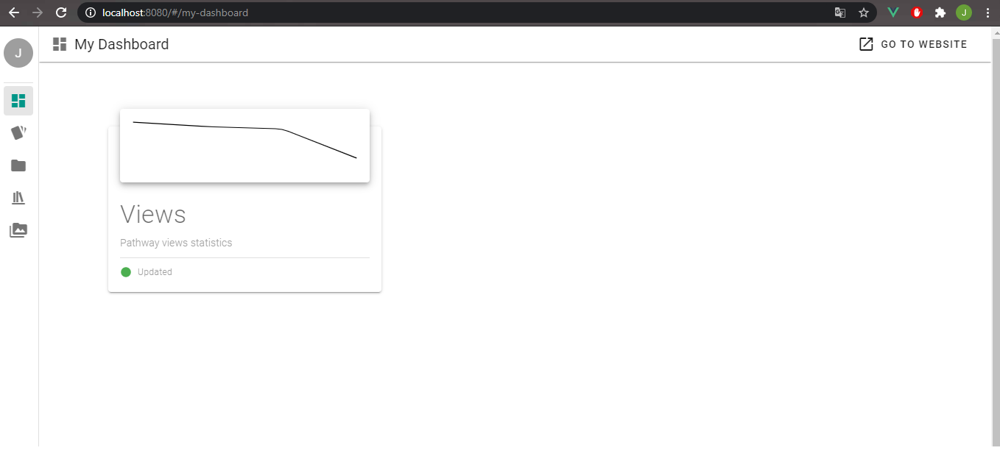
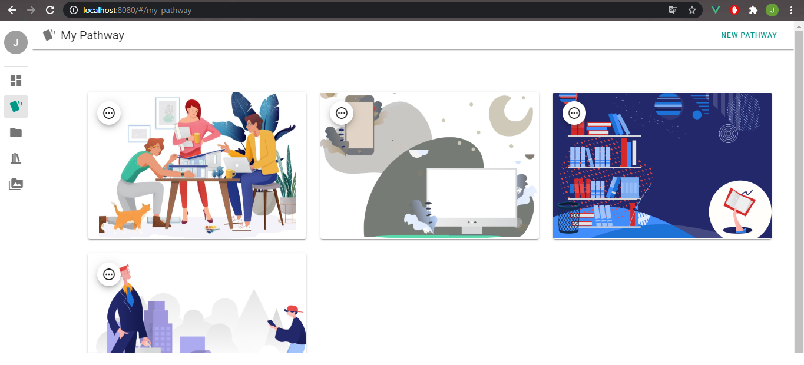

# Javlon Dash.

## Dashboard to My Portfolio Site

Chart is completely dynamic and depends on viewers count

## Tasks left to do

- [x] real time projects/pathways update supported
- [x] storing images and accessing through dashboard
- [ ] create **Code Share** screen 
- [ ] Implement own plugin support 
